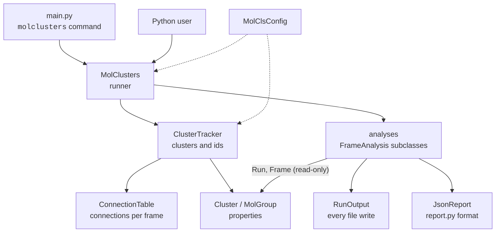
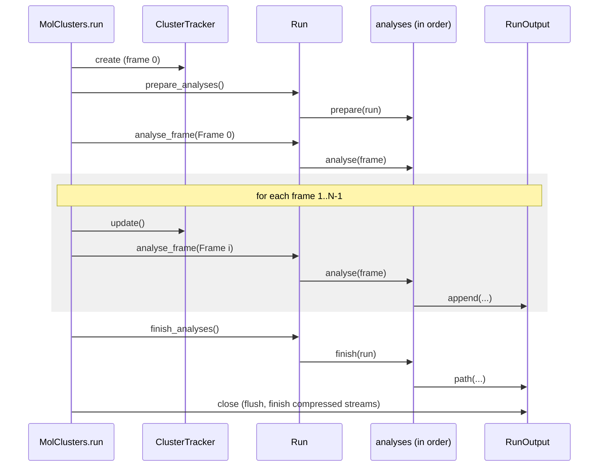

# Architecture

## Layers

Each layer only knows the ones below it:

- **`main.py`** turns command-line arguments into a Universe and a configuration:
  it picks the trajectory format, applies LAMMPS residue names, elements and
  timestep, loads frames into memory, guesses elements and names, then hands over to
  `MolClusters`. Everything the command line does beyond that is available from
  Python.
- **`MolClusters`** (`molclusters.py`) is only the runner. Its constructor warns
  about residue names the topology lacks and builds the analyses. The configuration
  fills in its own defaults, such as `solvent`, when it's validated. `run()`
  rewinds the trajectory, creates a fresh `ClusterTracker`, updates it frame by frame
  and drives the analyses, so running again gives the same results.
- **`ClusterTracker`** (`tracker.py`) owns the clusters and their ids, and nothing
  else: no analysis, no file output. Each `update()` rebuilds the connection table
  for the new frame and reconciles the connected groups with the previous clusters
  (see [The tracking algorithm](tracking.md)), recording what happened in a
  `Transition`.
- **`ConnectionTable`** (`conntable.py`) finds which molecules connect in the
  current frame, one NetworkX graph whose nodes are resids, from the `cm` rules
  (`capped_distance` on whole-molecule centers of mass) and the `hb` rules
  (`HydrogenBondAnalysis`, driven one frame at a time), and splits it into
  connected groups.
- **Analyses** (`analysis/`) read the clusters through `Run` and `Frame`, never the
  tracker, and write every file through `RunOutput`.

## A run, step by step

`Run._hook` wraps every call to an analysis: it tags what's logged meanwhile with
the analysis' name (`logger.contextualize(analysis=...)`, shown as a `[Name]` prefix
by `log._formatter`), notes on any exception which analysis, hook and frame raised
it (the CLI prints those notes), and adds up the time spent in `Run.durations`,
logged at the end next to the tracker's.

## Clusters and groups

`MolGroup` (`cluster.py`) is any set of residues, e.g. a nucleus. Its properties are
computed on the group made whole across the periodic boundaries (`whole()`), which
never moves the shared Universe for good: residues are placed along a spanning tree
(a `Cluster`'s own graph, or a plain group's minimum spanning tree of centers), so
groups wider than half the box stay whole, and a cluster wrapping around the box is
warned about once.

Each residue is made whole along its bonds or, when the topology has none (`_has`,
logged once), by minimum image around its first atom
(`conntable._whole_residue_offsets`), as the `cm` rule does; that warns once when a
molecule reaches 80% of the minimum-image limit (`_check_reach`). Bonded runs keep
their exact output. Without a box (`_has_box`), positions are taken as they are;
without partial charges, `charge`, `dipole` and `dipole_moment` are NaN, warned once.

The whole positions and the geometric properties (`@_per_frame`: `radius`, Rg,
sphericity, dipole moment, shape, center of mass, dipole, `bsphere`) are computed
once per frame and residue set (`_frame_cache`), since analyses read them
repeatedly. A part of a group made with `subgroup` (the nuclei of a cluster) starts
that frame with the group's whole positions, rather than being made whole again,
which costs as much as for the group.

A group can't be changed through what it hands out, which is also what makes caching
arrays safe. Every array it returns is read-only (`_readonly`; callers change a
`.copy()`). `residues` is a new group over a copy of its indices each time: a group's
`ix` can't be made read-only, since MDAnalysis' Cython code needs it writable. Its
`universe` is a read-only property.

`Cluster(MolGroup)` adds the id, a frozen `graph` (`nx.freeze`, plus read-only views
of its edge, node and graph attribute dicts), `birth_time`/`age`, `neighbors` and
`distance`. Clusters are read-only outside the tracker: its only mutator is
`Cluster._update`, which `ClusterTracker.update` calls to swap in the new frame's
frozen graph. The objects are live, so they describe the current frame only.

## Analyses

Each built-in is a `FrameAnalysis` subclass producing one kind of output. They take
their options as constructor arguments; `analysis/builtins.py`'s `BUILTINS` says how
each is built from the configuration and which options it `needs`, and
`build_builtins` builds those that run: those whose options are set, unless the
configuration's `analyses` turns them off. User analyses passed to `MolClusters` run
after the built-ins but before those marked `last` (the report). See
[Adding a built-in analysis](builtin-analyses.md).

## Files

Every file write goes through `RunOutput` (`output.py`), reached as `Run.output` or
`Frame.output`:

- `path(name)` for whole files, written once (typically in `finish`);
- `append(name, data)` for per-frame files, buffered in memory (opening a file
  costs milliseconds on Windows, which dominated runs that appended every frame)
  and flushed when the buffer is full and at the end. A file's first flush in a run
  overwrites it, so runs never mix. Names ending in `.gz`/`.zst` are compressed into
  one stream per run, ending a block at every flush, so a killed run leaves
  everything flushed readable.

Each analysis declares its files in `outputs` (`OutputFile`, with `<placeholder>`
patterns for families like `cls-id<id>.gro`). The declarations drive the checks
against an earlier run in the same directory (what gets overwritten, which files of
a family this run didn't rewrite) and the end-of-run summary.

## The report

`report.py` holds the format of `molclusters.jsonl.zst` (schema in its module
docstring), its encoders and its reader; `analysis/report.py` holds `JsonReport`,
which writes it. The report knows no other analysis: those that add fields do so by
overriding `FrameAnalysis.report_frame`/`report_cluster`, and `JsonReport`, which
runs last, finds them through `Run.analyses`. See
[Changing the report format](report-format.md).

## Configuration

`MolClsConfig` (`config.py`) is a pydantic-settings model. Its validators parse
the rule strings into `CMRule`/`HBRule` objects (stored in a `SymmetricDict` keyed by
residue-name pair, rejecting a pair given two different rules), expand the `solute`
keyword, default `solvent` to the rules' residue names other than the solutes, merge
the LAMMPS id ranges, and check `analyses` against `BUILTINS` (a lazy import, since the analysis package
imports the configuration). `describe()` renders the effective configuration for the
log. A new key needs a field here, validation if it has a syntax of its own, a line
in `describe()`, and a section in the [configuration docs](../user-guide/configuration.md).

## LAMMPS specifics

- Topologies carry no residue names: `lammps_resnames` supplies them, applied in
  `main._apply_lammps_resnames`.
- Dumps record step numbers, and MDAnalysis times them as step × dt (dt = 1 unless
  given). `lammps_timestep` is passed as `dt` by `main._lammps_dump_timestep`, which
  warns when a dump is read without it. A dump reader's `dt` is the MD timestep, not
  the time between frames, so `main._log_system` works from the frames' own times.
- `--traj-memory` doesn't use MDAnalysis' `in_memory`/`transfer_to_memory`, whose
  in-memory reader times frame i as i × dt from 0 (losing start times, uneven
  spacing, and a dump's spacing): `main._load_into_memory` copies the frames, times
  included, into a `main._TimedMemoryReader`.

## Performance notes

- `distance_backend` only affects the `cm` rules' `capped_distance` calls, and
  MDAnalysis ignores it under its auto-selected `nsgrid` method. The PyPI Windows
  wheel of MDAnalysis (checked on 2.10.0) has its OpenMP extension compiled without
  OpenMP (`MDAnalysis.lib.distances.USED_OPENMP is False`), so `OpenMP` silently runs
  serial code there; `_warn_if_openmp_unavailable` warns about it.
- `hb` rules drive `HydrogenBondAnalysis` through private methods (`_prepare`,
  `_single_frame`, `_ts`), checked at construction by `_check_hb_private_api` so an
  MDAnalysis upgrade that removes them fails early rather than mid-run.
- The log ends with the time spent tracking and in each analysis; start there.
