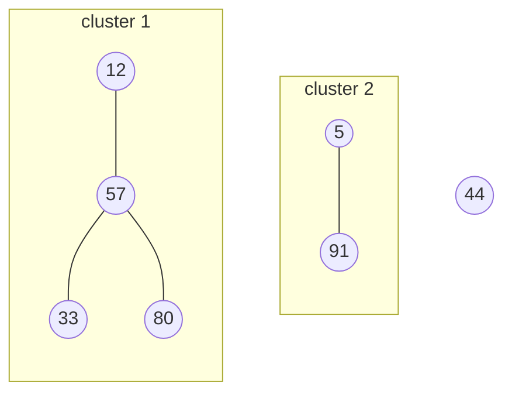

# How clusters are tracked

## Molecules, connections and clusters

MolClusters works on **molecules**: the residues of the topology, each identified by
its residue id (`resid`). Atoms only matter through the molecule they belong to.

Two molecules are **connected** in a frame when a [rule](configuration.md#rules)
for their pair of residue names holds:

- a `cm` rule connects them when their centers of mass are closer than a cutoff;
- an `hb` rule connects them when at least one hydrogen bond joins them.

Residue-name pairs without a rule never connect. Distances follow the minimum-image
convention of the periodic box, and a molecule split across the box boundary is made
whole before its center of mass is computed.

A **cluster** is a set of two or more molecules linked to each other, directly or
through other molecules, and to nothing else: a connected component of the graph
whose nodes are molecules and whose edges are connections. A molecule connected to
nothing is **free**, and belongs to no cluster.

Here molecule 44 is free, and molecules 12 and 80 belong to cluster 1 although they
are not connected to each other directly.

Connected groups whose set of residue names matches an
[`ignore_composition`](configuration.md#ignore_composition) entry are not clusters,
e.g. to ignore clusters made of solvent only.

## Cluster ids

Every cluster gets an integer **id**, from 1 up, in the order the clusters are first
seen. From one frame to the next the clusters change: molecules join and leave,
clusters break apart and come together. MolClusters decides which cluster of the new
frame *is* which cluster of the previous one, so that a cluster keeps its id for as
long as it is recognisably the same cluster. This is what makes lifetimes, per-cluster
trajectories (`cls-id<id>.gro`) and lineage meaningful.

It does so in two steps, each looking at the whole frame at once:

1. **Each previous cluster picks the new group that best continues it**: the one
   holding the most of its molecules. On a tie, the smallest (purest) group wins. A
   single molecule does not carry a cluster's identity: a cluster whose molecules all
   ended up in different groups, or free, picks nothing.
2. **Each new group continues the cluster that gave it the most molecules**, among
   those that picked it; on a tie, the oldest (the lowest id). A group that no
   previous cluster picked is a **new cluster**, with a new id.

## Events

The following events come out of these two rules. They are what
[`cluster_events.csv`](outputs.md#cluster_eventscsv) records.

| Event | What happens | Ids |
| --- | --- | --- |
| **formation** | free molecules come together | a new id |
| **growth**, **shrinking** | molecules join or leave a cluster | the cluster keeps its id (not recorded as an event) |
| **split** | a cluster breaks into pieces | it keeps its id in the piece holding most of its molecules; the other pieces get new ids |
| **merge** | clusters come together | the one that contributed most molecules (the oldest on a tie) keeps its id; the others end |
| **dissolution** | a cluster falls apart into free molecules, or into single molecules scattered over other clusters | its id ends |

A few consequences worth knowing when reading the results:

- A dimer made of one molecule from each of two clusters is always a *new* cluster:
  neither contributed more than a single molecule.
- A cluster that merges into another ends even if a remnant of it is left elsewhere:
  that remnant is a new cluster, split off the merged one.
- An id is never reused. A short-lived fluctuation — a cluster that splits in two
  and comes back together a frame later — mints a new id that lives for one frame.
  Such one-frame clusters are common in noisy systems; the
  [lifetimes table](outputs.md#cluster_lifetimescsv) says how many lived a single
  frame, so they can be filtered out.
- Everything is decided from consecutive frames of the trajectory as analysed. If
  frames are skipped (e.g. `--in-memory-step`), events between them are not seen,
  and larger jumps make ids less stable.

## Time and lifetimes

A cluster's **birth time** is the time of the first frame it appears in (for the
clusters already there at the first frame, that frame's time). An event is stamped
with the first frame that shows it, so a cluster's end (its *death time*) is the
time of the first frame it is gone from, and its **lifetime** is
`DeathTime − BirthTime`, a whole number of frame spacings: a cluster seen in a single
frame lived one spacing.

Lifetimes are *censored* when the cluster was already there at the first frame or is
still there at the last: it lived at least that long. The lifetimes table flags both
cases (`BornAtStart`, `AliveAtEnd`).

### How precise the times are

MolClusters only sees the clusters at the frames of the trajectory, \(\Delta t\)
apart: the spacing of the saved frames, multiplied by `--in-memory-step` if frames
are skipped. What happens between two frames is unknown, which limits every time it
reports.

**Birth and death.** A cluster first seen in the frame at time \(t_k\) formed
after the frame before it, at some time in \((t_k - \Delta t,\ t_k]\). Likewise, a
cluster whose `DeathTime` is \(t_m\) ended at some time in
\((t_m - \Delta t,\ t_m]\). Both times are stamped late, by anything between 0 and
\(\Delta t\).

**Lifetimes.** A cluster that formed and ended within the run, seen in \(n\)
consecutive frames (`NFrames`), has a recorded lifetime of \(n\,\Delta t\) (with
evenly spaced frames). It was there in
those \(n\) frames and absent from the frames just before and just after them, so
its true lifetime \(\tau\) lies in

\[
(n - 1)\,\Delta t \;<\; \tau \;<\; (n + 1)\,\Delta t .
\]

| `NFrames` | Recorded lifetime | True lifetime |
| --- | --- | --- |
| 1 | \(\Delta t\) | between 0 and \(2\Delta t\) |
| 2 | \(2\Delta t\) | between \(\Delta t\) and \(3\Delta t\) |
| \(n\) | \(n\,\Delta t\) | between \((n-1)\Delta t\) and \((n+1)\Delta t\) |

Each lifetime is thus uncertain by up to \(\pm\Delta t\), and recorded lifetimes
only take whole multiples of \(\Delta t\). The relative uncertainty falls as
\(1/n\): a cluster seen in 100 frames has a lifetime known to about 1%, while one
seen in a single frame has only an upper bound. Since the birth and the end are
both stamped late, their errors partly cancel. If events are equally likely at any
moment between two frames, a lifetime's error follows a triangular distribution on
\((-\Delta t, \Delta t)\): zero on average, with a standard deviation of
\(\Delta t/\sqrt{6} \approx 0.41\,\Delta t\). Averaging over many clusters does not
shift the lifetimes of the clusters that are seen, but see below for the ones that
aren't.

**What the sampling misses.** Anything that begins and ends between two frames is
invisible:

- A cluster that forms and ends between two frames is never seen. Short-lived
  clusters are undercounted, so the lifetime distribution is cut off below about
  \(\Delta t\), and averages are biased toward longer lifetimes.
- Several events between two frames look like one. A cluster that splits and comes
  back together, or loses a molecule and regains it, looks unchanged. With coarser
  sampling, ids can also be assigned differently (see [Events](#events)).

**Fluctuations at a cutoff.** A connection whose distance (or hydrogen-bond angle)
hovers around its rule's cutoff switches on and off from frame to frame. A cluster
held together by such a connection can end and be replaced by a new one a frame
later, which cuts what is physically one long-lived aggregate into several short
lifetimes. Finer sampling catches more of these flickers, not fewer, so lifetimes
depend on the rules' cutoffs as well as on \(\Delta t\).

**In practice:**

- Report \(\Delta t\) with any time or lifetime. Compare lifetimes only between
  analyses with the same \(\Delta t\) and the same rules.
- Check that a result doesn't depend on the sampling. Analyse again with every
  second frame (`--traj-memory --in-memory-step 2`) and see whether the quantity
  you report changes. If it does, the sampling sets it, not the physics.
- Treat lifetimes of a few \(\Delta t\), and the one-frame clusters
  (`NFrames` = 1) in particular, as ranges rather than values. Bin lifetime
  histograms in multiples of \(\Delta t\).
- Keep the censored lifetimes (`BornAtStart`, `AliveAtEnd`) apart. They are
  lower bounds: the true lifetime can be longer by any amount, not just by
  \(\Delta t\).
- If the frames aren't evenly spaced (e.g. runs with different output rates joined
  together), \(\Delta t\) is the local spacing around each event.

Times come from the trajectory, in picoseconds. LAMMPS dumps only store step
numbers; see [LAMMPS systems](lammps.md#times) to get times in ps.
